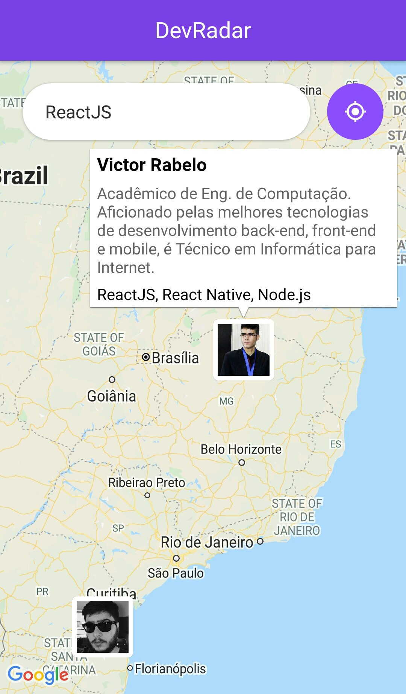

<h1 align="center">
 
DevRadar
</h1>

The repository of a mobile application that allows you to find developers who use the same technologies in a nearby area and the web version where you can register them, built in a Omnistack Week

  

  
  

    
    
  
 
 
 

## Features

This app features all the latest tools and practices in mobile development!

- ⚛️ **React Js** — A JavaScript library for building user interfaces
- ⚛️ **React Native** — A lib that provides a way to create native apps for Android and iOS
- 💹 **Node Js** — A web framework for Node Js
- 📄 **MongoDB** — A cross-platform and open-source document-oriented database
- ♻️ **Socket IO** — A library for realtime web applications 
- :iphone: **Expo** —  A tool used in mobile development with React Native that allows easy access to the device’s native API’s

## Getting started

1. Clone this repo using `git clone git@github.com:victor3r/DevRadar.git`
2. Move yourself to the appropriate directory: `cd DevRadar` 

### Getting started with the backend server

1. Move yourself to the backend folder: `cd backend`
2. Run `yarn` to install dependencies 
3. Create a `.env` file and add the MongoDB url connection in MONGO_URL field
4. Run `yarn dev` to start the server

### Getting started with the web app

1. Move yourself to the web folder: `cd web`
2. Run `yarn` to install dependencies 
3. Run `yarn start` to start the web application

### Getting started with the mobile app

1. Move yourself to the mobile folder: `cd mobile`
2. Run `yarn` to install dependencies 
3. Run `yarn start` to start the mobile app
4. Download the [Expo](https://expo.io/learn) app and scan the QR code that appears on the screen

## License

This project is licensed under the MIT License - see the [LICENSE](https://opensource.org/licenses/MIT) page for details.
